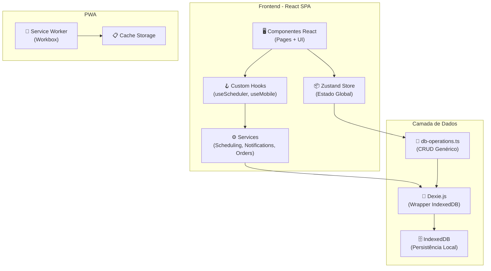
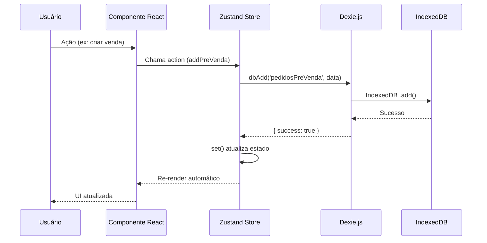
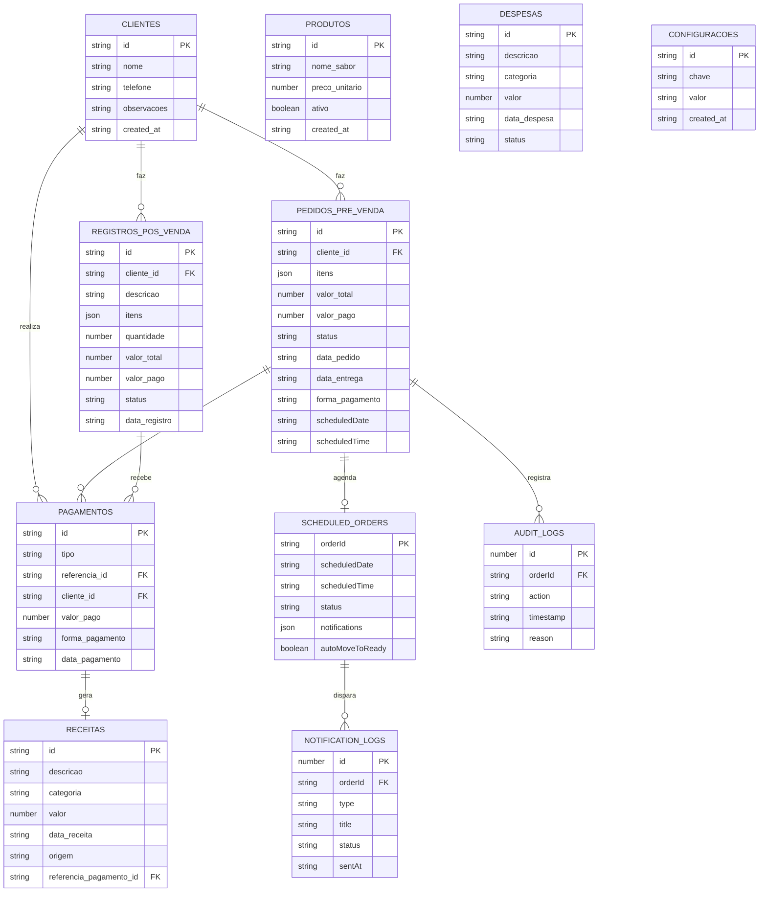

# 🛒 Flow Finance

> **Sistema moderno e completo de controle de vendas, estoque e financeiro para microempreendedores — funciona 100% offline como PWA.**


---

## 📸 Screenshots / Demo

### Dashboard Financeiro
<!-- TODO: Adicionar screenshot do Dashboard -->
*Visão geral com faturamento mensal, lucro, top compradores e produtos mais reservados.*

### Gestão de Vendas (Reservas e Pronta Entrega)
<!-- TODO: Adicionar screenshot da página de Pedidos -->
*Gerenciamento completo de reservas com entrega granular por item.*

### Controle de Devedores
<!-- TODO: Adicionar screenshot da página de Devedores -->
*Acompanhamento de contas a receber com pagamentos parciais e cobrança por WhatsApp.*

---

## 📋 Índice

- [🎯 Sobre o Projeto](#-sobre-o-projeto)
- [✨ Funcionalidades](#-funcionalidades)
- [🏗️ Arquitetura](#️-arquitetura)
- [🛠️ Stack Tecnológica](#️-stack-tecnológica)
- [📦 Pré-requisitos](#-pré-requisitos)
- [🚀 Instalação e Configuração](#-instalação-e-configuração)
- [⚙️ Variáveis de Ambiente](#️-variáveis-de-ambiente)
- [🖥️ Como Usar](#️-como-usar)
- [🗄️ Banco de Dados](#️-banco-de-dados)
- [🧪 Testes](#-testes)
- [📁 Estrutura do Projeto](#-estrutura-do-projeto)
- [📱 Progressive Web App (PWA)](#-progressive-web-app-pwa)
- [🚢 Deploy](#-deploy)
- [🤝 Contribuição](#-contribuição)
- [📝 Changelog / Roadmap](#-changelog--roadmap)
- [📄 Licença](#-licença)
- [👤 Autor / Contato](#-autor--contato)

---

## 🎯 Sobre o Projeto

O **Flow Finance** é uma solução completa e intuitiva projetada para ajudar **pequenos negócios, autônomos e microempreendedores** a gerenciar suas operações comerciais diárias. O sistema resolve problemas reais como:

- 📊 **Desorganização financeira** — centraliza faturamento, despesas, receitas e lucro em um só lugar
- 📦 **Controle de estoque manual** — gestão de produtos com baixa automática após vendas
- 💸 **Dificuldade em cobrar devedores** — rastreamento de contas a receber com pagamentos parciais
- 📱 **Necessidade de mobilidade** — interface mobile-first que funciona do celular, inclusive sem internet

### Diferenciais

| Característica | Descrição |
|---|---|
| 🔌 **Offline-First** | Todo o banco de dados roda no navegador via IndexedDB. Sem servidor, sem dependência de internet |
| 📱 **PWA Instalável** | Pode ser "instalado" como um app nativo no celular ou desktop |
| 🎯 **Mobile-First** | Projetado primariamente para uso no smartphone, com layout responsivo para desktop |
| 💰 **Zero Custo de Infraestrutura** | Não precisa de servidor, banco de dados externo ou serviço pago |

---

## ✨ Funcionalidades

### Módulo de Vendas
- [x] **Reservas / Encomendas** — Criação de pedidos com múltiplos itens, data de entrega e status
- [x] **Pronta Entrega** — Registro de vendas imediatas no balcão
- [x] **Entrega Granular** — Entrega individual de itens ou do pedido inteiro
- [x] **Agendamento de Pedidos** — Agendar pedidos para datas futuras com notificações automáticas
- [x] **Reagendamento e Cancelamento** — Reagendar ou cancelar pedidos agendados com log de auditoria
- [x] **Histórico de Ações** — Rastreamento completo de cada ação executada no pedido

### Módulo Financeiro
- [x] **Dashboard com KPIs** — Faturamento mensal, lucro, top 3 compradores e produtos mais reservados
- [x] **Gráficos interativos** — Visualização de dados com Recharts
- [x] **Controle de Despesas** — Cadastro de despesas com 12 categorias pré-definidas
- [x] **Controle de Receitas** — Receitas manuais e automáticas (geradas a partir de pagamentos)
- [x] **Pagamentos Parciais** — Suporte a pagamentos em parcelas com rastreamento de saldo devedor

### Módulo de Devedores
- [x] **Agrupamento por Cliente** — Visão consolidada de todas as dívidas por cliente
- [x] **Saldo Devedor Preciso** — Cálculo automático do valor restante considerando pagamentos parciais
- [x] **Pagamento por Item** — Pagar itens individualmente ou em lote
- [x] **Dias em Atraso** — Indicador visual de há quantos dias o valor está em aberto

### Módulo de Clientes e Produtos
- [x] **Cadastro de Clientes** — Nome, telefone e observações
- [x] **Cadastro de Produtos** — Nome/sabor, preço unitário e status ativo/inativo
- [x] **Busca inteligente** — Combobox com busca e criação rápida de clientes no ato da venda

### Módulo de Orçamentos
- [x] **Criação de Orçamentos** — Geração de orçamentos com múltiplos itens para clientes

### Notificações e Agendamento
- [x] **Notificação 1 dia antes** — Lembrete de pedidos para o dia seguinte
- [x] **Notificação na manhã** — Alerta matinal de pedidos do dia
- [x] **Notificação 1 hora antes** — Alerta urgente antes da entrega
- [x] **Auto-movimentação** — Pedidos passam automaticamente para "pronta entrega" no dia agendado
- [x] **Notificações do navegador** — Suporte a Browser Notifications (com permissão)

### Infraestrutura
- [x] **PWA Completo** — Instalável, offline-first, cacheable
- [x] **Seed Automático** — Dados iniciais de demonstração populados automaticamente
- [x] **Migração de Dados** — Migração automática de localStorage para IndexedDB
- [x] **Sistema de Migrações** — 4 versões de schema com upgrades automáticos
- [x] **Log de Auditoria** — Rastreamento de ações com timestamp e detalhes

### 🚧 Roadmap (Planejado)
- [ ] Relatórios financeiros avançados (DRE, Curva ABC)
- [ ] Backup automático em nuvem (Google Drive/Dropbox)
- [ ] Suporte a código de barras
- [ ] Modo escuro (Dark Mode)
- [ ] Exportação de dados para CSV, XLSX e PDF
- [ ] Botão "Cobrar" com mensagem pré-formatada para WhatsApp

---

## 🏗️ Arquitetura

### Padrão Arquitetural

O Flow Finance utiliza uma **arquitetura Local-First SPA** (Single Page Application). Todos os dados são persistidos **localmente no navegador** via IndexedDB, eliminando a necessidade de backend ou serviços em nuvem.

### Diagrama de Arquitetura



### Fluxo de Dados



### Decisões Técnicas

| Decisão | Motivação |
|---|---|
| **Vite** | Velocidade de inicialização e HMR (Hot Module Replacement) extremamente rápidos |
| **shadcn/ui** | Componentes de alta qualidade sem vendor lock-in — o código pertence ao projeto |
| **IndexedDB (Dexie.js)** | Funcionamento 100% offline, essencial para usuários em áreas com conexão instável |
| **Zustand** | Gerenciamento de estado leve (~1KB), sem boilerplate, fácil de debugar |
| **React Hook Form + Zod** | Formulários performáticos com validação tipada em runtime |

---

## 🛠️ Stack Tecnológica

### Core

| Tecnologia | Versão | Propósito |
|---|---|---|
| [React](https://react.dev/) | ^18.3.1 | Biblioteca UI reativa e componentizada |
| [TypeScript](https://www.typescriptlang.org/) | ^5.8.3 | Tipagem estática e segurança de tipos |
| [Vite](https://vitejs.dev/) | ^5.4.19 | Build tool e dev server ultra-rápido |
| [React Router DOM](https://reactrouter.com/) | ^6.30.1 | Roteamento SPA client-side |

### UI / UX

| Tecnologia | Versão | Propósito |
|---|---|---|
| [Tailwind CSS](https://tailwindcss.com/) | ^3.4.17 | Framework CSS utility-first responsivo |
| [shadcn/ui](https://ui.shadcn.com/) | — | 50+ componentes acessíveis e estilizáveis |
| [Radix UI](https://www.radix-ui.com/) | vários | Primitivos headless (base do shadcn/ui) |
| [Lucide React](https://lucide.dev/) | ^0.462.0 | Ícones vetoriais SVG consistentes |
| [Recharts](https://recharts.org/) | ^2.15.4 | Gráficos interativos compostos para React |
| [Sonner](https://sonner.emilkowal.dev/) | ^1.7.4 | Toast notifications elegantes |
| [Embla Carousel](https://www.embla-carousel.com/) | ^8.6.0 | Carrossel de conteúdo performático |
| [Vaul](https://vaul.emilkowal.dev/) | ^0.9.9 | Drawer/Sheet mobile-friendly |
| [CMDK](https://cmdk.paco.me/) | ^1.1.1 | Command palette / Combobox |

### Estado e Dados

| Tecnologia | Versão | Propósito |
|---|---|---|
| [Zustand](https://zustand-demo.pmnd.rs/) | ^5.0.11 | Gerenciamento de estado global leve |
| [Dexie.js](https://dexie.org/) | ^4.3.0 | Wrapper IndexedDB com API elegante |
| [TanStack React Query](https://tanstack.com/query) | ^5.83.0 | Gerenciamento de estado assíncrono e cache |
| [React Hook Form](https://react-hook-form.com/) | ^7.61.1 | Formulários performáticos não-controlados |
| [Zod](https://zod.dev/) | ^3.25.76 | Validação de schemas em runtime |
| [date-fns](https://date-fns.org/) | ^3.6.0 | Manipulação de datas imutável |

### Qualidade e Tooling

| Tecnologia | Versão | Propósito |
|---|---|---|
| [ESLint](https://eslint.org/) | ^9.32.0 | Linting e padronização de código |
| [Vitest](https://vitest.dev/) | ^3.2.4 | Framework de testes unitários rápido |
| [Testing Library](https://testing-library.com/) | ^16.0.0 | Testes centrados no usuário |
| [jsdom](https://github.com/jsdom/jsdom) | ^20.0.3 | Ambiente DOM para testes |

### Build e Infraestrutura

| Tecnologia | Versão | Propósito |
|---|---|---|
| [vite-plugin-pwa](https://vite-pwa-org.netlify.app/) | ^1.2.0 | Geração automática de Service Worker e manifest |
| [PostCSS](https://postcss.org/) | ^8.5.6 | Processamento de CSS |
| [Autoprefixer](https://autoprefixer.github.io/) | ^10.4.21 | Vendor prefixes automáticos |
| [tailwindcss-animate](https://github.com/jamiebuilds/tailwindcss-animate) | ^1.0.7 | Animações utilitárias Tailwind |
| [@vitejs/plugin-react-swc](https://github.com/nicolo-ribaudo/vite-plugin-react-swc) | ^3.11.0 | Transform JSX ultra-rápido via SWC |

---

## 📦 Pré-requisitos

Antes de começar, certifique-se de ter instalado:

| Software | Versão Mínima | Verificação |
|---|---|---|
| **Node.js** | 18.x ou superior | `node --version` |
| **npm** (ou pnpm/yarn/bun) | 9.x ou superior | `npm --version` |
| **Git** | qualquer | `git --version` |

> [!NOTE]
> O projeto também suporta **Bun** como runtime/package manager (contém `bun.lockb`).

---

## 🚀 Instalação e Configuração

### 1. Clone o repositório

```bash
git clone https://github.com/ghmata/flow-finance.git
cd flow-finance
```

### 2. Instale as dependências

```bash
# Com npm
npm install

# Ou com bun (mais rápido)
bun install
```

### 3. Inicie o servidor de desenvolvimento

```bash
npm run dev
```

A aplicação estará disponível em: **http://localhost:8080**

### 4. Build para produção

```bash
npm run build
```

Os arquivos otimizados serão gerados na pasta `dist/`.

### 5. Preview do build

```bash
npm run preview
```

---

## ⚙️ Variáveis de Ambiente

> [!TIP]
> O Flow Finance é uma aplicação **100% client-side** e **não requer variáveis de ambiente** para funcionar. Toda a configuração está embutida no código.

O servidor de desenvolvimento roda na porta `8080` por padrão, configurada em `vite.config.ts`:

```typescript
server: {
  host: "::",
  port: 8080,
}
```

Para alterar a porta, modifique o valor em `vite.config.ts` ou use:

```bash
npm run dev -- --port 3000
```

---

## 🖥️ Como Usar

### Scripts Disponíveis

```bash
npm run dev          # Inicia servidor de desenvolvimento (porta 8080)
npm run build        # Gera build de produção otimizado
npm run build:dev    # Gera build em modo de desenvolvimento
npm run preview      # Visualiza o build de produção localmente
npm run lint         # Executa verificação de código (ESLint)
npm run test         # Executa testes unitários (Vitest)
npm run test:watch   # Executa testes em modo watch
```

### Gestão de Vendas

<details>
<summary><strong>📝 Criar Nova Reserva</strong></summary>

1. Vá para a aba **Vendas** no menu inferior (mobile) ou sidebar (desktop)
2. Clique no botão **"+ Nova Reserva"**
3. Selecione o cliente no Combobox de busca (ou crie um novo inline)
4. Adicione os produtos com quantidade e preço
5. Opcionalmente, defina uma **data de entrega agendada**
6. Clique em **Confirmar**

</details>

<details>
<summary><strong>📦 Entregar Produtos</strong></summary>

1. Na aba **Vendas > Reservados**
2. Para entrega individual: clique em **"Entregar"** no item específico do pedido
3. Para entregar tudo: use o botão **"Entregar Todos"** para baixar todo o pedido

</details>

<details>
<summary><strong>💰 Registrar Pagamento</strong></summary>

1. Acesse a página **Devedores / A Receber**
2. Localize o cliente e sua dívida
3. Escolha entre:
   - **Pagamento por Item** — selecione itens específicos
   - **Pagamento em Lote** — pague múltiplos itens de uma vez
   - **Pagamento Parcial** — insira um valor que não cobre o total
4. Selecione a forma de pagamento (PIX, Dinheiro, Cartão Débito/Crédito, Transferência)
5. Confirme. O saldo devedor será atualizado automaticamente

</details>

<details>
<summary><strong>📊 Consultar Dashboard</strong></summary>

1. A página inicial (rota `/`) é o **Dashboard**
2. Visualize:
   - **Faturamento do mês** — soma de todos os pagamentos recebidos
   - **Top 3 Compradores** — clientes que mais gastaram no mês
   - **Top 3 Produtos Mais Reservados** — produtos com maior volume de pedidos
   - **Gráficos de desempenho** — visualização interativa com Recharts

</details>

### Gestão de Estoque

1. Acesse a página **Produtos** pelo menu
2. **Cadastre** novos produtos com nome/sabor e preço unitário
3. **Edite** ou **desative** produtos existentes
4. O estoque é atualizado automaticamente conforme vendas são registradas

### Gestão de Orçamentos

1. Acesse a página **Orçamentos** pelo menu
2. Crie orçamentos com múltiplos itens para clientes
3. Gerencie o ciclo de vida do orçamento (aberto, aceito, recusado)

---

## 🗄️ Banco de Dados

### Tecnologia

O Flow Finance utiliza **IndexedDB** como banco de dados, acessado através da biblioteca **Dexie.js**. Os dados ficam persistidos **localmente no navegador** do usuário.

### Diagrama ER (Entidade-Relacionamento)



### Tabelas Principais

| Tabela | Registros | Descrição |
|---|---|---|
| `clientes` | Ilimitado | Cadastro de clientes com telefone e observações |
| `produtos` | Ilimitado | Catálogo de produtos com preço e status |
| `pedidosPreVenda` | Ilimitado | Reservas/encomendas com múltiplos itens e status granular |
| `registrosPosVenda` | Ilimitado | Vendas de pronta entrega |
| `pagamentos` | Ilimitado | Registro de cada pagamento realizado |
| `despesas` | Ilimitado | Saídas financeiras categorizadas |
| `receitas` | Ilimitado | Entradas financeiras (manuais e automáticas) |
| `scheduledOrders` | Ilimitado | Pedidos agendados com controle de notificações |
| `auditLogs` | Ilimitado | Log de auditoria de todas as ações nos pedidos |
| `notificationLogs` | Ilimitado | Histórico de notificações enviadas |
| `configuracoes` | Poucas | Flags de sistema (ex: seed executado) |

### Sistema de Migrações

O banco possui **4 versões de schema** com migrações automáticas:

| Versão | Descrição |
|---|---|
| **v1** | Schema inicial com todas as tabelas base |
| **v2** | Migração de itens únicos para array de múltiplos itens por pedido |
| **v3** | Backfill de status granular (`paidAt`, `deliveredAt`) por item |
| **v4** | Adição das tabelas `scheduledOrders`, `auditLogs` e `notificationLogs` |

### Seed de Dados

Na primeira execução, o sistema popula automaticamente o banco com dados de demonstração a partir de `src/data/seed-data.json`:
- Produtos de exemplo com nomes e preços
- Clientes fictícios de demonstração

O seed é controlado pela flag `database_seeded` na tabela `configuracoes`.

---

## 🧪 Testes

### Framework

O projeto utiliza **Vitest** com **Testing Library** para testes unitários.

### Executando os Testes

```bash
# Executar todos os testes uma vez
npm run test

# Modo watch (re-executa ao salvar)
npm run test:watch
```

### Configuração

- **Ambiente**: jsdom
- **Setup**: `src/test/setup.ts`
- **Padrão de arquivos**: `src/**/*.{test,spec}.{ts,tsx}`
- **Path aliases**: `@/` → `./src/`

> [!NOTE]
> Atualmente a cobertura de testes é mínima (1 teste de exemplo). Contribuições com testes para os módulos críticos (store, serviços, componentes) são bem-vindas.

---

## 📁 Estrutura do Projeto

```
flow-finance/
├── 📄 index.html                  # Entry point HTML (PWA meta tags)
├── 📄 package.json                # Dependências e scripts npm
├── 📄 vite.config.ts              # Configuração Vite + PWA (porta 8080)
├── 📄 vitest.config.ts            # Configuração Vitest (jsdom)
├── 📄 tailwind.config.ts          # Tema Tailwind (cores, animações, sidebar)
├── 📄 postcss.config.js           # PostCSS (Tailwind + Autoprefixer)
├── 📄 eslint.config.js            # Configuração ESLint 9 flat config
├── 📄 components.json             # Configuração shadcn/ui
├── 📄 tsconfig.json               # TypeScript config raiz
├── 📄 tsconfig.app.json           # TypeScript config da aplicação
├── 📄 tsconfig.node.json          # TypeScript config para Node (configs)
│
├── 📂 public/                     # Assets estáticos
│   ├── 🖼️ favicon.ico             # Ícone do navegador
│   ├── 🖼️ pwa-512x512.png         # Ícone PWA (512x512)
│   ├── 📄 robots.txt              # Configuração de crawlers
│   └── 🖼️ placeholder.svg         # Imagem placeholder
│
└── 📂 src/                        # Código-fonte principal
    ├── 📄 main.tsx                # Entry point React (ReactDOM.render)
    ├── 📄 App.tsx                 # Componente raiz (Router + Providers)
    ├── 📄 App.css                 # Estilos globais do App
    ├── 📄 index.css               # Design tokens (CSS Variables + Tailwind)
    ├── 📄 vite-env.d.ts           # Tipos do Vite
    │
    ├── 📂 pages/                  # Páginas / Rotas
    │   ├── Dashboard.tsx          # "/" — KPIs, gráficos, rankings
    │   ├── Pedidos.tsx            # "/pedidos" — Reservas e pronta entrega
    │   ├── Clientes.tsx           # "/clientes" — CRUD de clientes
    │   ├── Produtos.tsx           # "/produtos" — CRUD de produtos
    │   ├── Devedores.tsx          # "/devedores" — Contas a receber
    │   ├── Orcamento.tsx          # "/orcamento" — Gestão de orçamentos
    │   ├── Index.tsx              # Redirect para Dashboard
    │   └── NotFound.tsx           # 404 — Página não encontrada
    │
    ├── 📂 components/             # Componentes reutilizáveis
    │   ├── Sidebar.tsx            # Menu lateral (desktop)
    │   ├── BottomNav.tsx          # Navegação inferior (mobile)
    │   ├── NavLink.tsx            # Link de navegação estilizado
    │   ├── PagamentoModal.tsx     # Modal de registro de pagamento
    │   │
    │   ├── 📂 pedidos/            # Componentes de pedidos
    │   │   ├── NovaReservaModal.tsx   # Modal de criação de reserva
    │   │   ├── PedidoItemRow.tsx      # Linha de item em um pedido
    │   │   ├── ClienteCombobox.tsx    # Combobox de busca/criação de clientes
    │   │   └── ProdutoCombobox.tsx    # Combobox de busca de produtos
    │   │
    │   └── 📂 ui/                 # 50 componentes shadcn/ui
    │       ├── button.tsx, card.tsx, dialog.tsx, ...
    │       └── (accordion, alert-dialog, badge, calendar,
    │            carousel, chart, checkbox, command, drawer,
    │            form, input, label, select, sheet, table,
    │            tabs, toast, tooltip, etc.)
    │
    ├── 📂 store/                  # Gerenciamento de estado
    │   └── useStore.ts            # Store Zustand (923 linhas, CRUD completo)
    │
    ├── 📂 hooks/                  # Custom hooks
    │   ├── useScheduler.ts        # Verificação periódica de agendamentos (5min)
    │   ├── use-mobile.tsx         # Detecção de viewport mobile
    │   └── use-toast.ts           # Hook de toast notifications
    │
    ├── 📂 services/               # Lógica de negócio
    │   ├── schedulingService.ts   # Agendar, reagendar, cancelar pedidos
    │   ├── notificationService.ts # Verificar e enviar notificações
    │   └── orderService.ts        # Remover/desfazer pronta entrega
    │
    ├── 📂 lib/                    # Utilitários e configurações
    │   ├── db.ts                  # Classe FlowFinanceDB (Dexie, schema, migrações)
    │   ├── db-operations.ts       # Funções CRUD genéricas (dbAdd, dbUpdate, etc.)
    │   ├── db-migration.ts        # Migração de localStorage para IndexedDB
    │   ├── seed-database.ts       # Seed de dados iniciais
    │   ├── date-utils.ts          # Utilitários de data (isInCurrentMonth)
    │   ├── test-db.ts             # Helpers de teste para banco
    │   └── utils.ts               # Utilitário cn() (clsx + tailwind-merge)
    │
    ├── 📂 types/                  # Definições TypeScript
    │   └── index.ts               # 13 interfaces + constantes (Cliente, Produto, etc.)
    │
    ├── 📂 utils/                  # Utilitários de UI
    │   └── masks.ts               # Máscaras de input (telefone, moeda BRL)
    │
    ├── 📂 data/                   # Dados estáticos
    │   └── seed-data.json         # Dados de seed (produtos e clientes)
    │
    └── 📂 test/                   # Testes
        ├── setup.ts               # Setup do Vitest (jest-dom matchers)
        ├── example.test.ts        # Teste de exemplo
        └── verify-schedule.ts     # Script de verificação de agendamento
```

---

## 📱 Progressive Web App (PWA)

O Flow Finance é um **PWA completo** com as seguintes capacidades:

| Recurso | Status | Descrição |
|---|---|---|
| ✅ **Instalável** | Ativo | Pode ser instalado como app nativo em qualquer dispositivo |
| ✅ **Offline-first** | Ativo | Todo o banco de dados roda localmente no IndexedDB |
| ✅ **Responsivo** | Ativo | Interface adaptada para mobile (BottomNav) e desktop (Sidebar) |
| ✅ **Service Worker** | Ativo | Cache de assets estáticos e fontes Google (1 ano) |
| ✅ **Auto-update** | Ativo | Service Worker atualiza automaticamente (`autoUpdate`) |

### Configuração PWA

O manifest é gerado automaticamente via `vite-plugin-pwa`:

- **Tema**: `#0d9488` (Teal)
- **Display**: `standalone`
- **Orientação**: `portrait`
- **Ícone**: `pwa-512x512.png` (512x512, any + maskable)

### Como Instalar

| Plataforma | Instruções |
|---|---|
| **Android (Chrome)** | Menu ⋮ → "Instalar aplicativo" ou "Adicionar à tela inicial" |
| **iOS (Safari)** | Botão Compartilhar ↗ → "Adicionar à Tela de Início" |
| **Desktop (Chrome/Edge)** | Clique no ícone 📥 na barra de endereços |

---

## 🚢 Deploy

### Plataformas Suportadas

Como é uma **SPA estática** sem backend, o Flow Finance pode ser hospedado gratuitamente em qualquer provedor de conteúdo estático:

| Plataforma | Dificuldade | Observações |
|---|---|---|
| [Vercel](https://vercel.com/) | ⭐ Fácil | Deploy automático via GitHub |
| [Netlify](https://www.netlify.com/) | ⭐ Fácil | Deploy automático via GitHub |
| [GitHub Pages](https://pages.github.com/) | ⭐⭐ Médio | Requer configuração de SPA fallback |
| [Cloudflare Pages](https://pages.cloudflare.com/) | ⭐ Fácil | CDN global incluído |

### Passo a Passo (Genérico)

```bash
# 1. Gerar build de produção
npm run build

# 2. Os arquivos otimizados estarão em dist/
# 3. Faça o deploy da pasta dist/ no provedor escolhido
```

> [!IMPORTANT]
> Por ser uma SPA com React Router, configure o fallback para `index.html` em todas as rotas no seu provedor de hospedagem. Caso contrário, rotas diretas como `/pedidos` retornarão 404.

### Deploy na Vercel (Recomendado)

1. Conecte seu repositório GitHub na [Vercel](https://vercel.com/)
2. Framework Preset: **Vite**
3. Build Command: `npm run build`
4. Output Directory: `dist`
5. Deploy automático a cada push na branch `main`

---

## 🤝 Contribuição

Contribuições são bem-vindas! Siga os passos abaixo:

### Como Contribuir

1. **Fork** o repositório
2. Crie uma **Feature Branch**
   ```bash
   git checkout -b feature/minha-feature
   ```
3. **Commit** suas mudanças seguindo [Conventional Commits](https://www.conventionalcommits.org/):
   ```bash
   git commit -m 'feat: adiciona relatório DRE'
   git commit -m 'fix: corrige cálculo de saldo devedor'
   git commit -m 'docs: atualiza README com nova seção'
   ```
4. **Push** para a branch
   ```bash
   git push origin feature/minha-feature
   ```
5. Abra um **Pull Request**

### Padrões de Código

- **TypeScript** obrigatório — evite `any` sempre que possível
- **ESLint** — rode `npm run lint` antes de commitar
- **Componentes** — máximo ~250 linhas, use composição para componentes grandes
- **Hooks** — extraia lógica complexa para custom hooks
- **Formulários** — use React Hook Form + Zod para validação

---

## 📝 Changelog / Roadmap

### ✅ Versão 1.0 (Atual)

- [x] Gestão completa de reservas e pronta entrega
- [x] Controle de estoque (cadastro de produtos com preço)
- [x] Cadastro de clientes com busca inteligente
- [x] Orçamentos
- [x] Dashboard com KPIs e gráficos
- [x] Controle de devedores com pagamentos parciais
- [x] Sistema de agendamento com notificações
- [x] Log de auditoria
- [x] Funcionamento Offline completo (PWA)
- [x] Migração automática de dados (localStorage → IndexedDB)
- [x] Seed de dados de demonstração

### 🚧 Versão 1.1 (Planejado)

- [ ] Relatórios financeiros avançados (DRE, Curva ABC)
- [ ] Backup automático em nuvem (Google Drive/Dropbox)
- [ ] Suporte a código de barras
- [ ] Modo escuro (Dark Mode)
- [ ] Exportação de dados (CSV, XLSX, PDF)
- [ ] Botão "Cobrar" — mensagem pré-formatada para WhatsApp
- [ ] Melhoria no funcionamento offline real

---

## 📄 Licença

Este projeto está sob a licença **MIT**. Veja o arquivo [LICENSE](LICENSE) para mais detalhes.

---

## 👤 Autor / Contato

Desenvolvido por **GH Mata** — [GitHub](https://github.com/ghmata)

---

<div align="center">

⭐ **Se este projeto te ajudou, considere dar uma estrela no repositório!** ⭐

Feito com ❤️ e ☕ para microempreendedores brasileiros.

</div>
